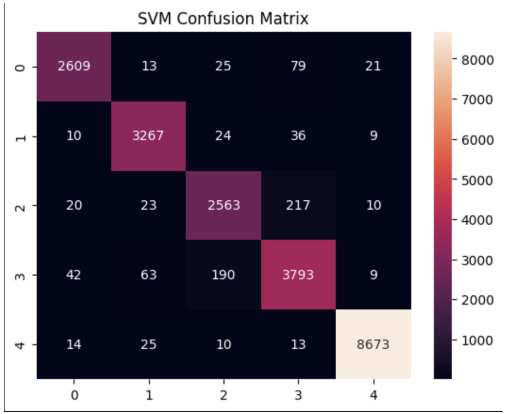
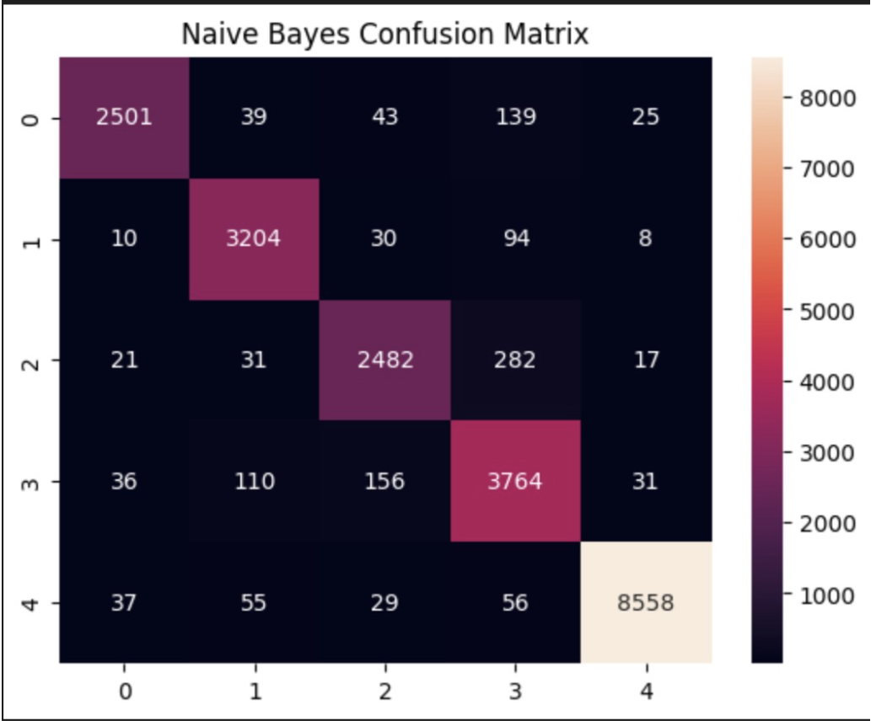
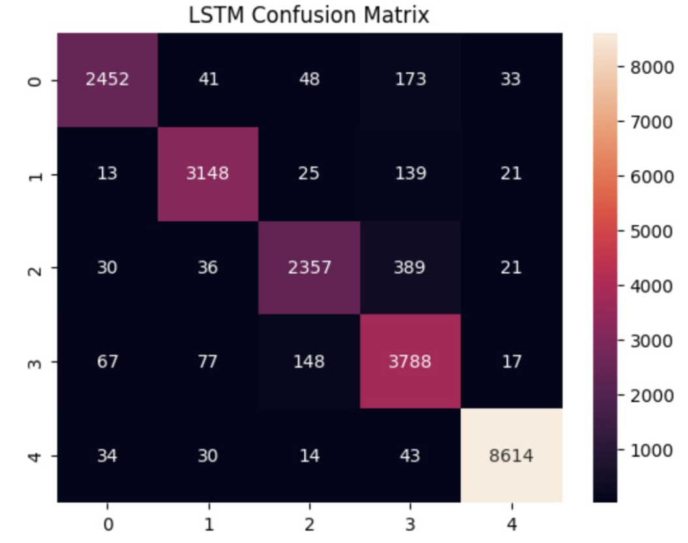
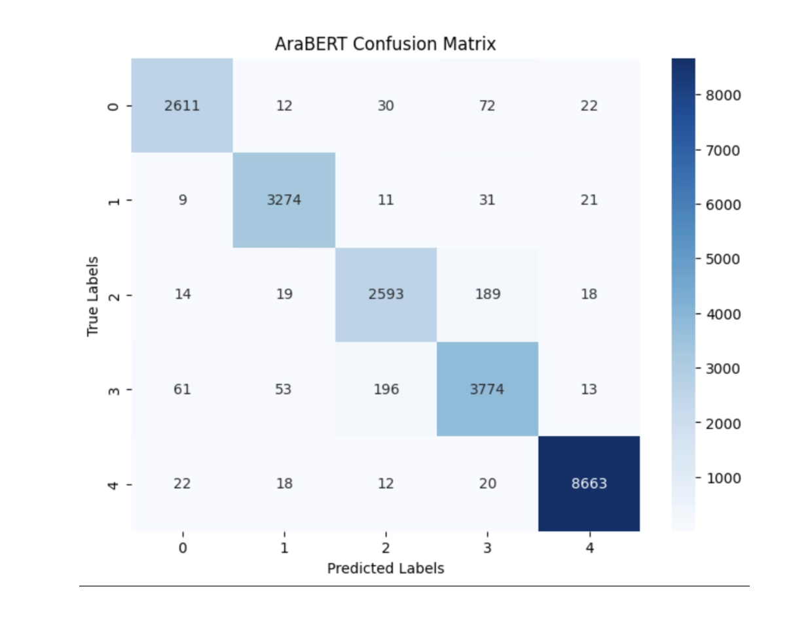
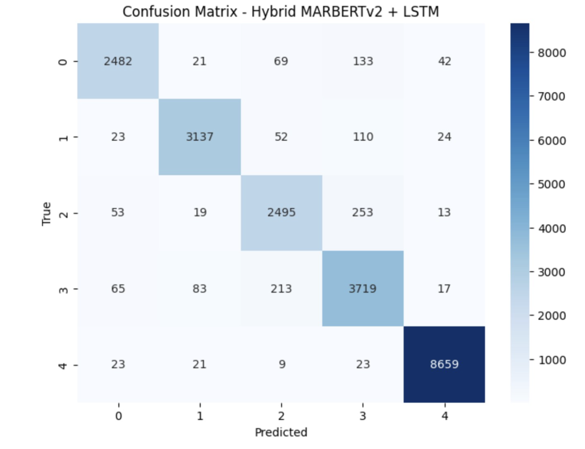

# Arabic Fake News Detection

This project focuses on improving fake news detection in Arabic using both traditional Machine Learning and Deep Learning approaches. Multiple models including SVM, Naive Bayes, LSTM, AraBERT, and a Hybrid MarBERT+LSTM architecture were developed and evaluated on a large-scale Arabic news dataset containing over 108,000 samples.

## Key Highlights
- Multiclass Arabic fake news classification (5 classes)
- Traditional ML and Transformer-based comparison
- AraBERT and MarBERT implementations
- Hybrid MarBERT + BiLSTM architecture
- Comprehensive performance evaluation

## Dataset
- 108,789 Arabic news samples
- 5 target classes
- 87,031 training samples
- 21,758 testing samples

## Technologies Used
Python, PyTorch, Hugging Face Transformers, Scikit-learn, Pandas, NumPy, Matplotlib, Seaborn, AraBERT, MarBERT, LSTM

## Results
| Model | Accuracy |
|---------|---------|
| SVM | 96.07% |
| Naive Bayes | 94.25% |
| LSTM | 93.57% |
| AraBERT | 96.13% |
| Hybrid MarBERT+LSTM | 94.18% |

## Confusion Matrices

### Support Vector Machine (SVM)

### Naive Bayes

### Long Short-Term Memory (LSTM)

### AraBERT

### Hybrid MarBERT + LSTM

## Future Work
- Improve Hybrid MarBERT+LSTM architecture
- Reduce training epochs
- Explore attention-enhanced sequence models
